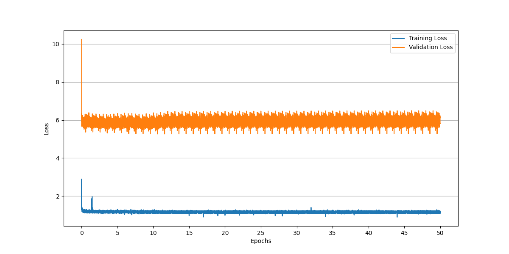
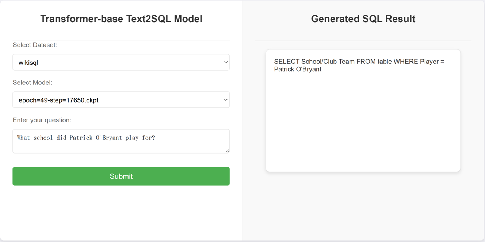

# NEUSWC_FinalProject_Transformer_Text2sql
## WikiSQL or Spider？基于transformer的Text2SQL模型探索与实现
### 东北大学软件学院2024-2025秋季学期自然语言处理大作业
本项目构建了基于Transformer的text2sql模型，在Wikisql数据集和Spider数据集上使用pytorch lighting框架进行训练，项目展示如下。
### Wikisql Loss曲线

### Wikisql 效果

### Spider Loss曲
